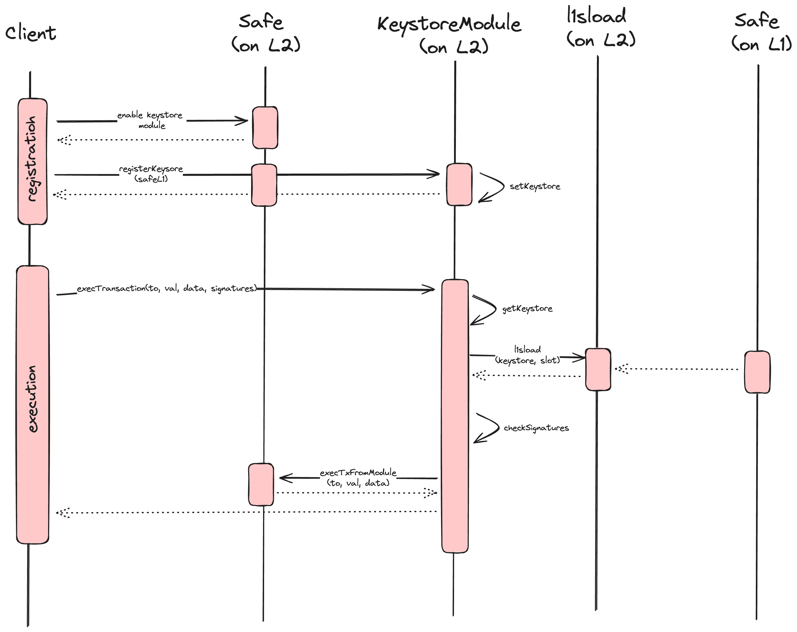
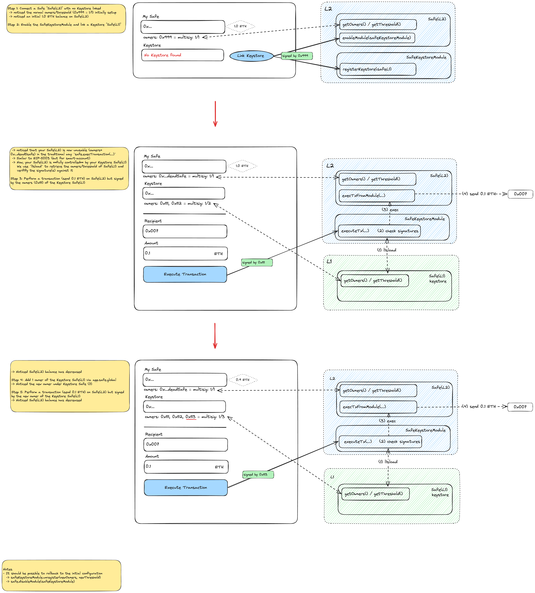

# Safe x Scroll: l1sload module demonstration 

This project demonstrates a basic use-case where a safe on a Layer2 `safe(L2)` inherits its keystore (configuration/security policy: `owners` and `threshold`) from a Safe on a Layer1 `safe(L1)` via a Safe module `SafeRemoteKeystoreModule` enabled on `safe(L2)`. 

This Module can optionally set a guard to prevent `safe(L2)` to use its local keystore and only enable the remote keystore of `safe(L1)` as valid keystore.

It leverages a precompiled contract called `l1sload` to load a storage slot on the L1 chain (see [L1SLOAD spec](https://scrollzkp.notion.site/L1SLOAD-spec-a12ae185503946da9e660869345ef7dc)).




## Getting started

### Contracts
```shell
yarn install
npx hardhat compile
npx hardhat test
npx hardhat coverage
npx hardhat run scripts/deploy.ts --network <network>
```

### Frontend
```shell
cd frontend
yarn install
yarn dev
open http://localhost:3000
```

## Demo



## TODO
- [X] Add test with ERC20
- [ ] Include `l1sload` when ready
- [ ] Support EIP-712 signature